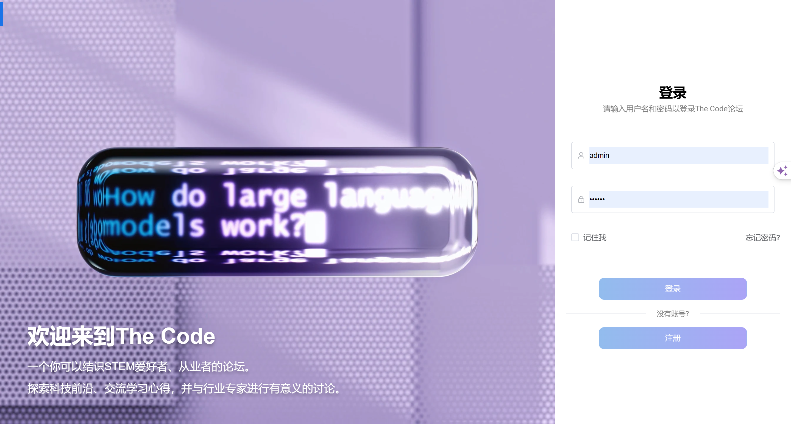
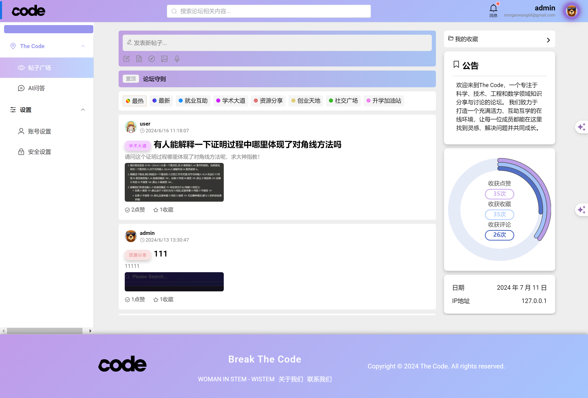
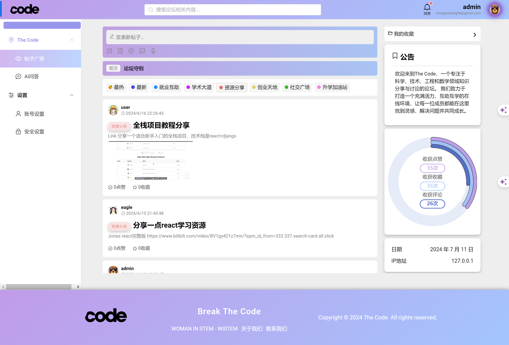
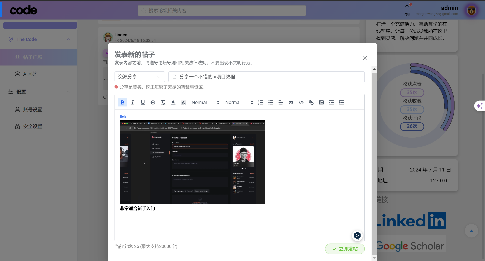
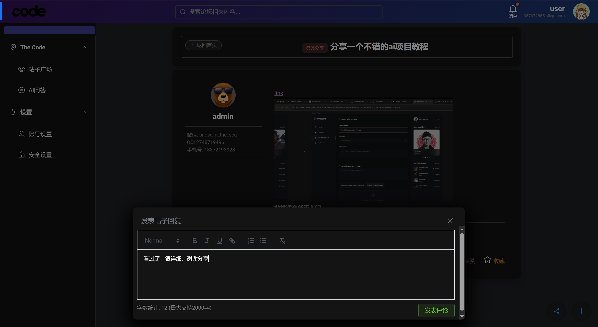
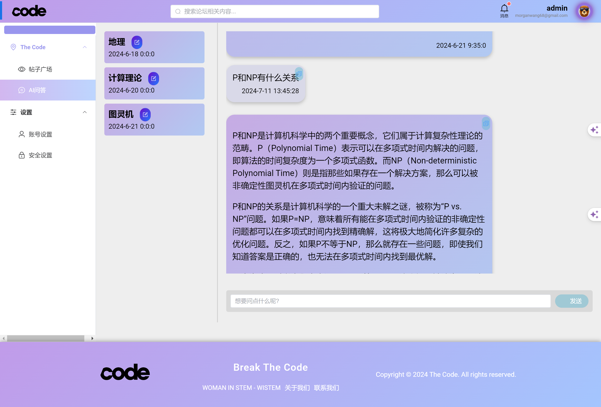
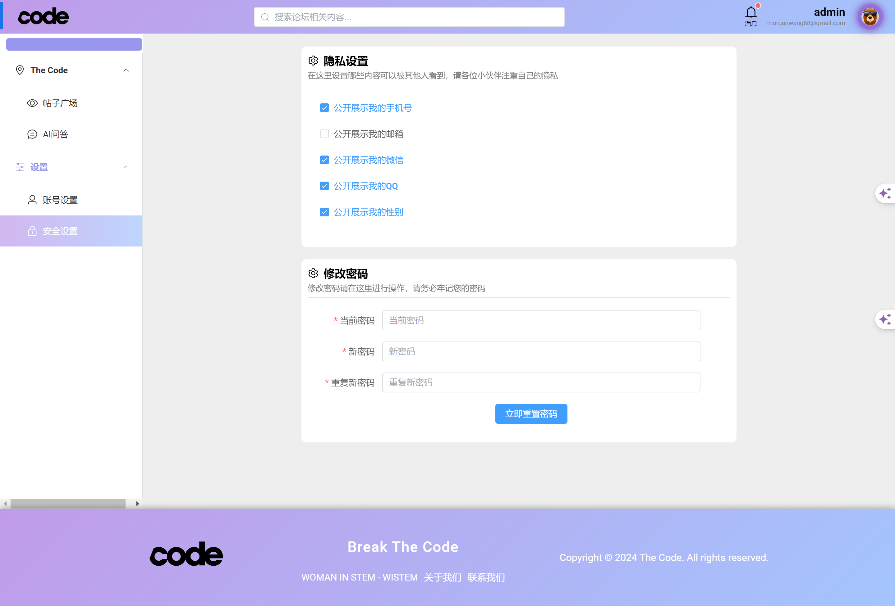

# The Code

**Other language versions: [中文](README_zh.md), [English](README.md),.**

### "Break The Code" — Breaking Boundaries, Coding Dreams, Exploring the Universe of STEM with The Code.

**The Code** is a STEM community forum designed to empower women, igniting their limitless potential on the tech stage.
Here, every voice is heard, and every innovation is encouraged.

- **Safe and Inclusive**: We offer a welcoming environment where users can register, log in, share, and discuss without
  worry.

- **Personalized Experience**: Customized user settings provide a unique interaction space for each member.

- **Community Engagement**: Through comments, likes, and favorites, we spark community interaction. The messaging module
  ensures you stay connected.

- **Intelligent Conversations**: AI-driven real-time chat and history review make learning and interaction more dynamic
  and convenient.

Join **The Code** to collaboratively code our future, unleash potential, and create a universe of STEM knowledge
together.

## Tech Stack

### Frontend:

- Vue 3
- Element Plus

### Backend:

- Spring Boot 3
- MyBatis-Plus
- Spring Security
- Swagger
- RabbitMQ

### Databases:

- MySQL 5.7
- Redis

### Storage:

- Minio

### Other Technologies:

- Snowflake Algorithm
- Logback

## Features


### User Authentication

- **Login**

- **Registration**

- **Forget Password**

### Profile Management

- **Profile Customization**: Tailored user profiles to reflect individual identities.

- **Privacy Settings**: Granular controls to safeguard user information.

### Content Management & Display

- **Post Creation**: Versatile content publishing to foster innovation.
- **Thread Curation**: Smart content organization for optimized information flow.
- **Advanced Search**: Precision-based content discovery for targeted interests.
- **Trend Analysis**: Real-time tracking of community focal points and discussions.

### Community Engagement

- **Comments**: Instantaneous feedback to boost community interaction.
- **Appreciation System**: Positive reinforcement mechanism for quality contributions.
- **Intelligent Bookmarking**: Personalized content curation for efficient information retrieval.

### Messaging & Notification System

- **Alert Center**: Timely notifications to keep users informed of critical updates.

### AI-Enhanced Interaction

- **Live AI Chat**: Cutting-edge AI-powered real-time chat for enriched user experience.
- **History Conversations**

## Characteristics

- Real-time data synchronization (WebSocket)
- User avatar storage (Minio)
- Rich text editor (Delta format)
- Image upload functionality
- Data caching strategy (Redis)
- High-frequency operation optimization
- Security features (Spring Security & JWT)
- Captcha expiration control
- Rate limiting & anti-spam measures
- Error and exception handling
- CORS policy
- Multi-environment configuration
- Comprehensive logging system

## Local Setup

- Start Redis

- Start Minio on port 9999 (configurable)

### Frontend Setup

- Navigate to the frontend project directory

```bash
  cd my-project-frontend
```

- Install dependencies

```bash
  npm install
```

- Start the server

```bash
  npm run dev
```

### Backend Setup

- Run MyProjectBackendApplication

## Screenshots

### Login



### Registration


### Forget Password


### Forum Homepage



### Browse Categories



### Search Posts


### Create Post



### Create Comments



### Post Details


### Share Post


### AI Chat


### AI Chat History



### My Collections


### Security Settings



### Account Settings


## Author

- [@SheEagle](https://github.com/SheEagle)

[](https://www.linkedin.com/in/xiru-wang-551103248/)
[](https://github.com/SheEagle)

