# The Code

**其他语言版本: [English](README.md), [中文](README_zh.md).**

### "Break The Code" —— 打破界限，编码梦想，与The Code共同探索STEM的星辰大海。

**The Code**，一个为女性打造的STEM交流论坛，点燃女性在科技舞台上的无限光芒。这里，每一个声音都被倾听，每一次创新都被鼓励。

- **安全与包容**：我们提供一个温馨的环境，让用户无忧地注册、登录、分享和讨论。

- **个性化体验**：定制化的用户设置，让每位成员都能享受独特的交流空间。

- **社区活力**：通过评论、点赞、收藏，我们激发社区的互动火花，消息模块让连接永不掉线。

- **智慧对话**：AI驱动的实时聊天和历史回顾，让学习和交流更加生动和便捷。

加入**The Code**，让我们携手编码未来，释放潜能，共创STEM知识宇宙。

## 技术栈

### 前端：

- **框架**: Vue 3
- **路由管理**: Vue-Router
- **状态管理**: Pinia
- **UI组件库**: Element Plus

### 后端：

- **核心框架**: Spring Boot 3
- **持久层框架**: MyBatis-Plus - 增强的MyBatis框架，简化数据库操作。
- **安全框架**: Spring Security - 提供全面的安全服务和权限校验。
- **API文档**: Swagger - 自动生成RESTful API文档，简化前后端协作。
- **消息队列**: RabbitMQ - 用于异步处理，实现应用解耦。

### 数据库：

- **关系数据库**: MySQL 5.7 - 流行的开源关系数据库管理系统。
- **缓存数据库**: Redis - 内存中数据库，用于数据缓存和消息队列。

### 存储：

- **对象存储**: Minio - 高性能的分布式对象存储服务。

### 其他技术：

- **分布式ID生成**: 雪花算法 (Snowflake) - 生成唯一ID，解决分布式系统中的ID生成问题。
- **日志管理**: Logback - Java日志框架，用于应用日志记录和监控。

## 功能

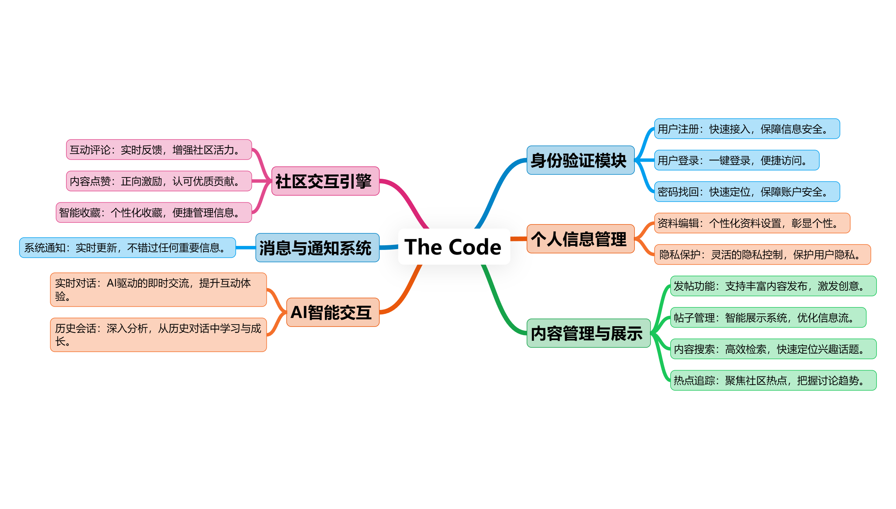

### 身份验证模块

- **用户注册**：快速接入，保障信息安全。
- **用户登录**：一键登录，便捷访问。
- **密码找回**：快速定位，保障账户安全。

### 个人信息管理

- **资料编辑**：个性化资料设置，彰显个性。
- **隐私保护**：灵活的隐私控制，保护用户隐私。

### 内容管理与展示

- **发帖功能**：支持丰富内容发布，激发创意。
- **帖子管理**：智能展示系统，优化信息流。
- **内容搜索**：高效检索，快速定位兴趣话题。
- **热点追踪**：聚焦社区热点，把握讨论趋势。

### 社区交互引擎

- **互动评论**：实时反馈，增强社区活力。
- **内容点赞**：正向激励，认可优质贡献。
- **智能收藏**：个性化收藏，便捷管理信息。

### 消息与通知系统

- **私信功能**：私密交流，保障沟通安全。
- **系统通知**：实时更新，不错过任何重要信息。

### AI智能交互

- **实时对话**：AI驱动的即时交流，提升互动体验。
- **历史回顾**：深入分析，从历史对话中学习与成长。

## 特性

- **实时数据同步**: 使用WebSocket实现服务器与客户端之间的实时数据同步。
- **用户头像存储**: 用户头像通过Minio对象存储实现，简化存储和访问流程。
- **富文本编辑器**: 采用Delta数据格式，防止XSS攻击，优化数据传输效率。
- **图片上传功能**: 支持一键粘贴图片上传，直接同步到对象存储服务。
- **数据缓存策略**: 论坛帖子列表数据通过Redis缓存，减轻数据库访问压力。
- **高频操作优化**: 点赞和收藏操作通过Redis存储，降低数据库负载。
- **安全特性**: 集成Spring Security和Jwt，确保用户数据安全。
- **验证码过期控制**: 使用Redis存储验证码，自动过期，增强账户安全性。
- **限流防刷**: 利用Redis进行IP限流，防止恶意访问。
- **错误和异常处理**: 统一的错误和异常响应机制，便于问题追踪和处理。
- **跨域处理**: CORS策略确保资源跨域安全共享。
- **多环境配置**: 支持开发、测试和生产多环境配置，适应不同运行需求。
- **日志记录**: 详尽的日志记录系统，包含请求信息和雪花ID，便于问题定位。

## 在本地运行

- 启动Redis

- 在端口9999上启动minio（可在配置文件中修改端口）

### 启动前端

- 前往前端项目目录

```bash
  cd my-project-frontend
```

- 安装依赖

```bash
  npm install
```

- 启动服务器

```bash
  npm run dev
```

- 前往后端目录

```bash
  cd my-project-backend
```

### 启动后端

- 运行MyProjectBackendApplication

## 运行截图

### 登录

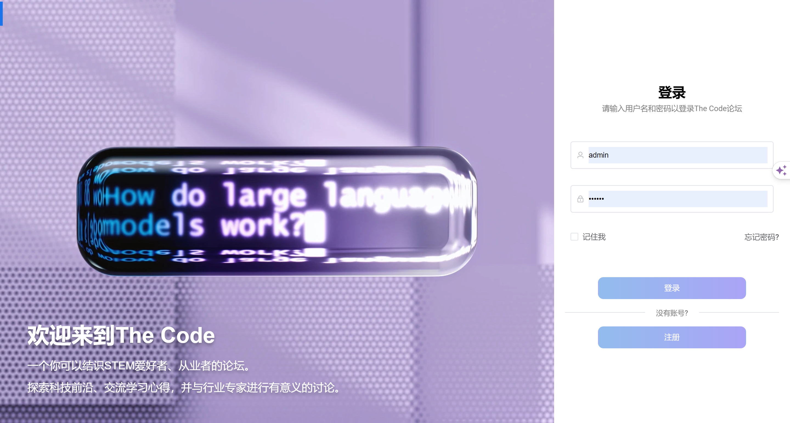

### 注册

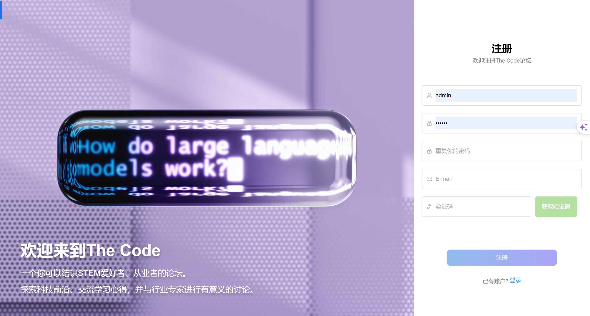

### 忘记密码

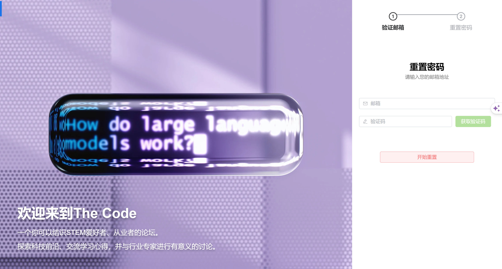

### 论坛首页

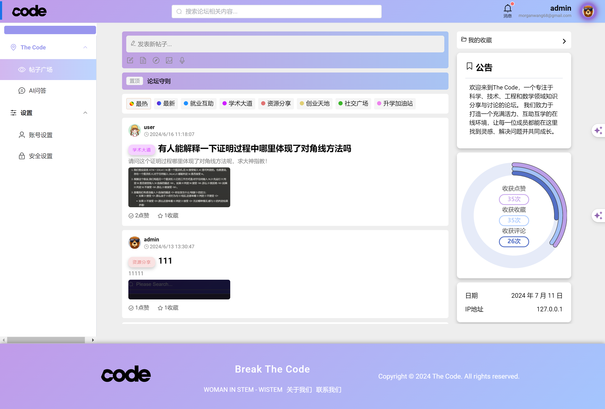

### 分类看帖


### 搜索帖子

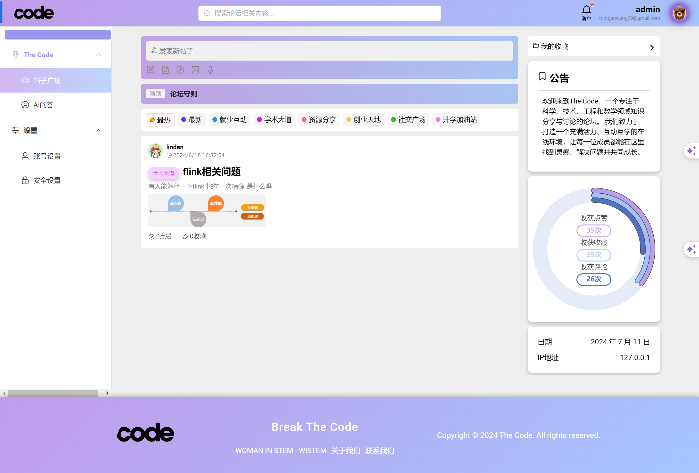

### 发帖


### 评论

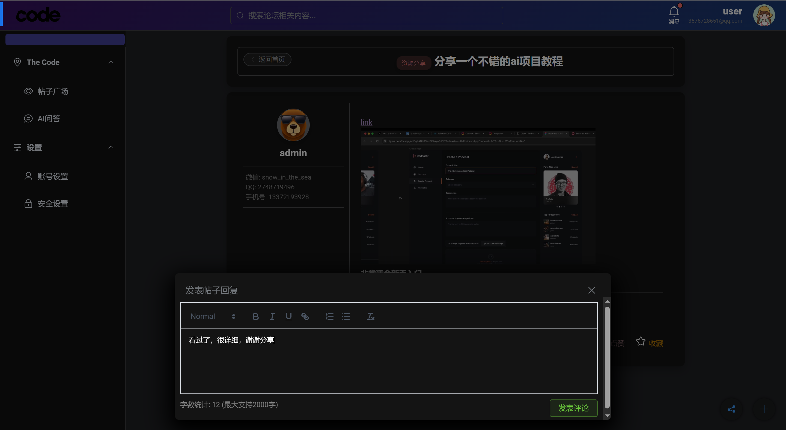

### 帖子详情

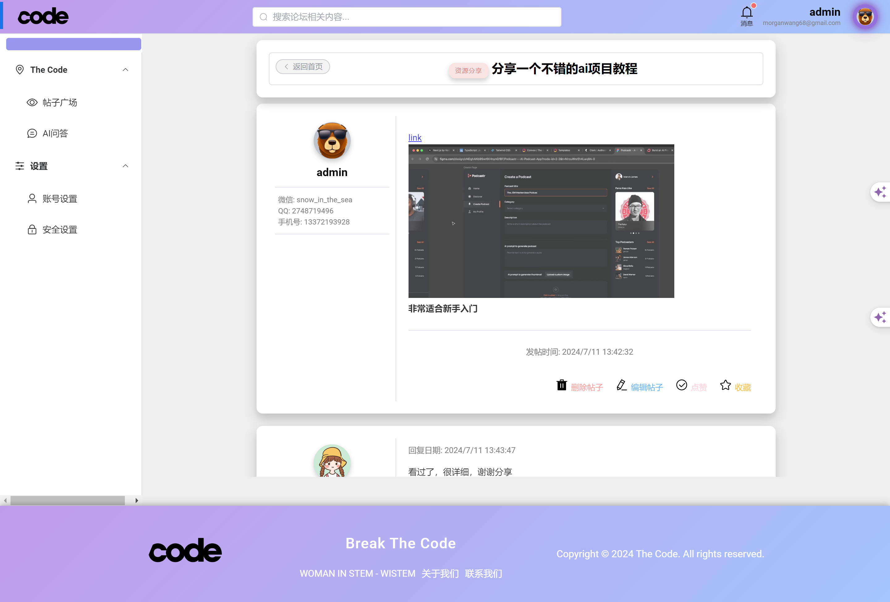

### 分享贴子

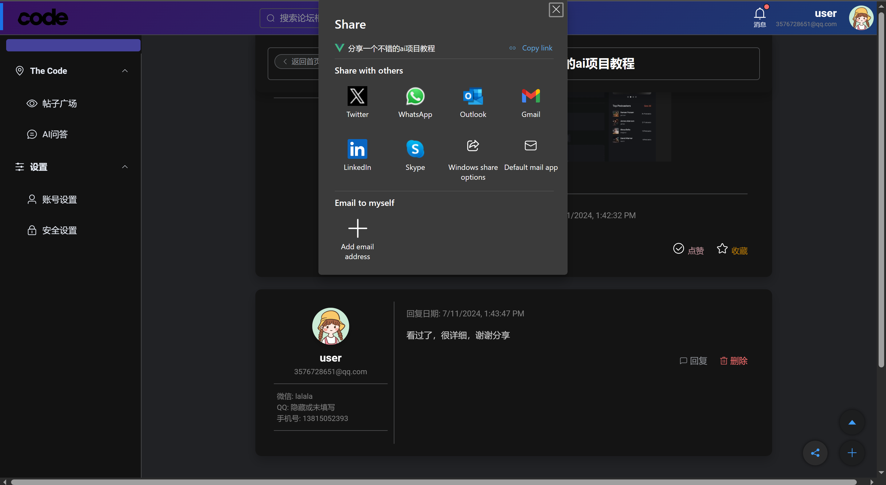

### ai实时对话

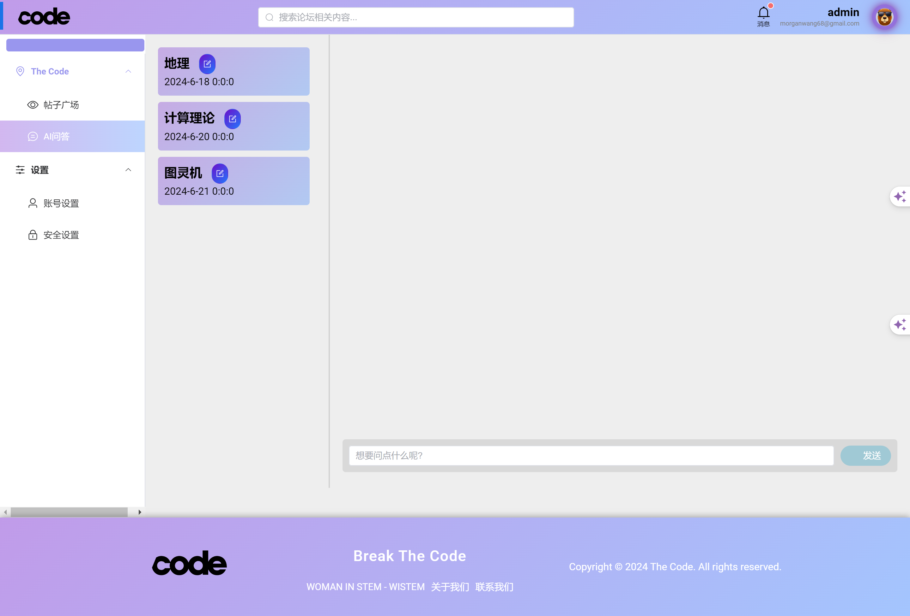

### ai历史会话

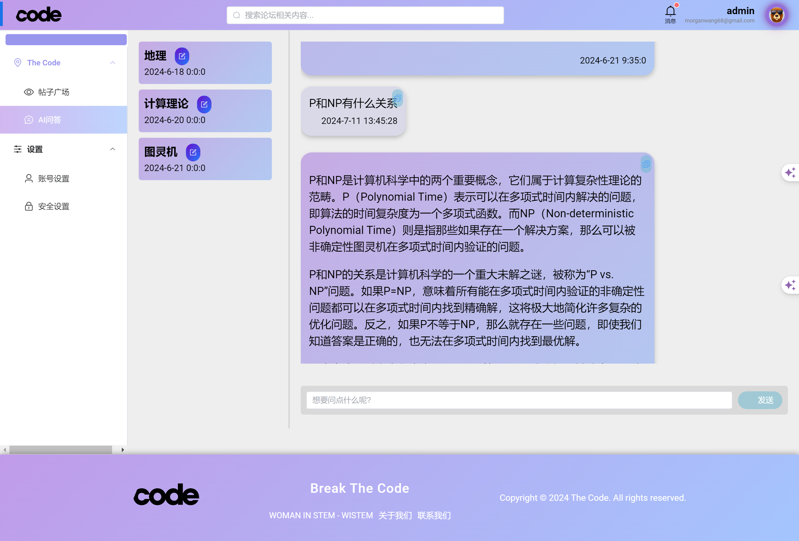

### 我的收藏

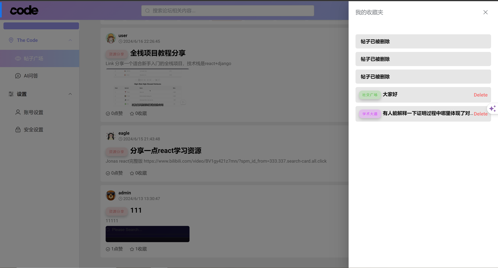

### 安全设置

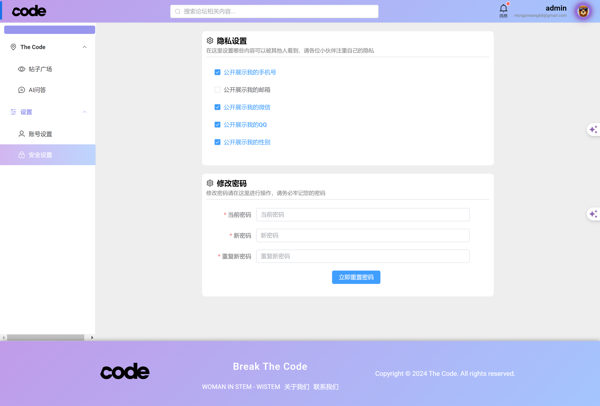

### 账号设置

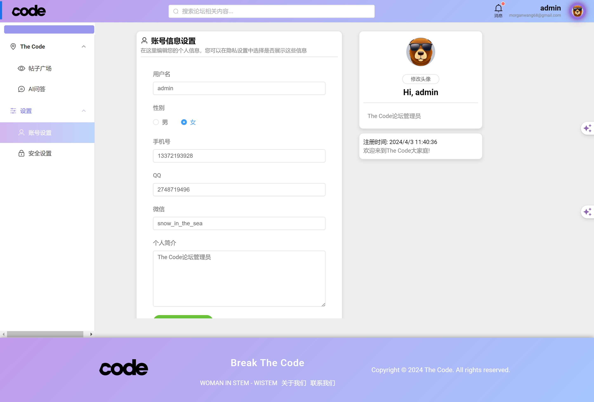

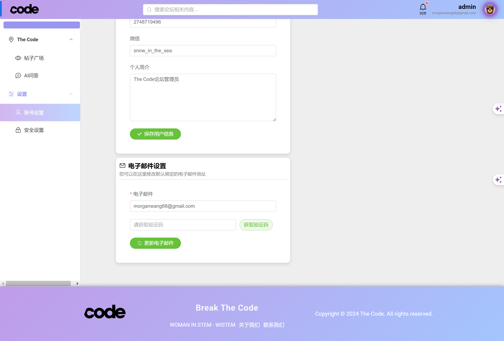

## 作者

- [@SheEagle](https://github.com/SheEagle)

[](https://www.linkedin.com/in/xiru-wang-551103248/)
[](https://github.com/SheEagle)

